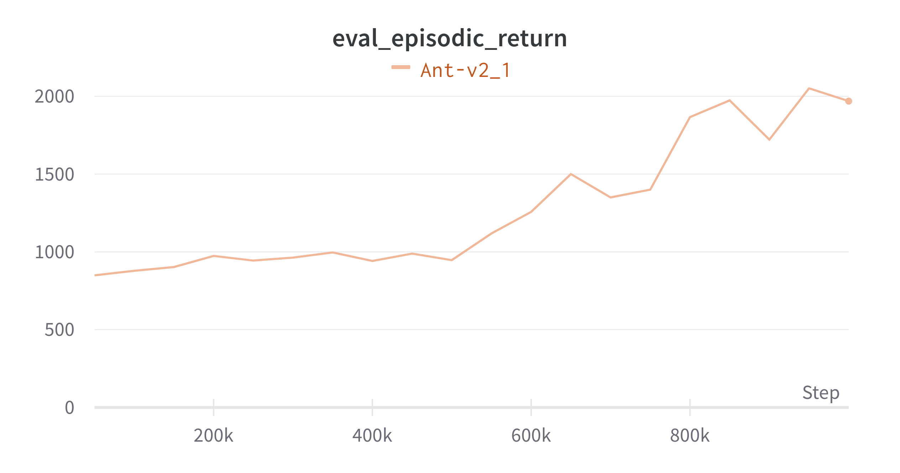
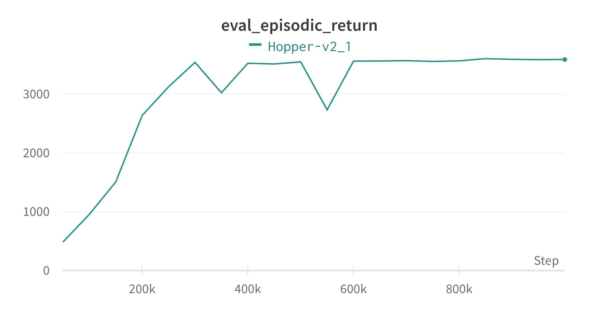

# RPC-Pytorch
Pytorch replication of the paper : [Robust Predictable Control](https://arxiv.org/abs/2109.03214)

# Results

### RPC agent using 0.3 bits/time-step on Ant-v2  

### RPC agent using 1 bits/time-step on Hopper-v2  

